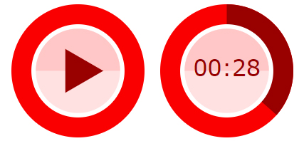

<h1 align='left'>
  React Simple Audio Player
</h1>

<p align='left'>
  A React component with graphics for playing audio files</a>
</p>



### Usage

```bash
npm install react-simple-audio-player --save
```

```js
import React, { Component } from 'react'
import PlayAudio from 'react-simple-audio-player'

class App extends Component {
  render () {
    return <PlayAudio url={'http://www.noiseaddicts.com/samples_1w72b820/4186.mp3'} />
  }
}
export default App;
```

The component uses `react-player` package to play media and add simple design and controls to extend the package.


### Props

Prop | Description | Default
---- | ----------- | -------
`url` | The url of an audio to play
`width` | Set the width and height (height is equal to width) of the player | `60px`
`simpleMode` | Set to `true` disable seconds counter, automatically `true` with width less than `45px` | `false`
`colorScale` | Pass array of 5 colors for theme personalisation | scaled red shades (see demo)


### Changing color theme example
```js
import React, { Component } from 'react'
import PlayAudio from 'react-simple-audio-player'
import chroma from "chroma-js"

const colorScale = chroma
    .scale([
        '#0199CB',
        '#ffffff',
    ])
    .mode('lch')
    .colors(5)

class App extends Component {
    render () {
        return <PlayAudio url={'http://www.noiseaddicts.com/samples_1w72b820/4186.mp3'} colorScale={colorScale} />
    }
}
export default App
```

Result:

